## Network: AlexNet
### Exit 1 | total
```
0.5001 < x <= 0.5501: 2819 | 820 | 0.2909
0.5501 < x <= 0.6000: 4016 | 1386 | 0.3451
0.6000 < x <= 0.6500: 3105 | 2129 | 0.6857
0.6500 < x <= 0.7000: 8358 | 5791 | 0.6929
0.7000 < x <= 0.7500: 8666 | 6568 | 0.7579
0.7500 < x <= 0.8000: 12651 | 10306 | 0.8146
0.8000 < x <= 0.8500: 63328 | 56886 | 0.8983
0.8500 < x <= 0.9000: 13463 | 11305 | 0.8397
0.9000 < x <= 0.9500: 203235 | 179073 | 0.8811
0.9500 < x <= 1.0000: 68408 | 66305 | 0.9693
['0.50-', '0.55-', '0.60-', '0.65-', '0.70-', '0.75-', '0.80-', '0.85-', '0.90-', '0.95-']
[0.2908832919474991, 0.3451195219123506, 0.6856682769726248, 0.6928691074419717, 0.7579044541887837, 0.814639158959766, 0.8982756442647802, 0.8397088316125678, 0.8811129972691711, 0.969257981522629]
```

### Exit 1 | normal
```
0.5001 < x <= 0.5500: 1830 | 37 | 0.0202
0.5500 < x <= 0.6000: 1362 | 228 | 0.1674
0.6000 < x <= 0.6500: 746 | 25 | 0.0335
0.6500 < x <= 0.7000: 2441 | 17 | 0.0070
0.7000 < x <= 0.7500: 2027 | 15 | 0.0074
0.7500 < x <= 0.8000: 2283 | 6 | 0.0026
0.8000 < x <= 0.8500: 6345 | 11 | 0.0017
0.8500 < x <= 0.9000: 1168 | 67 | 0.0574
0.9000 < x <= 0.9500: 136367 | 130841 | 0.9595
0.9500 < x <= 1.0000: 39446 | 37609 | 0.9534
['0.50-', '0.55-', '0.60-', '0.65-', '0.70-', '0.75-', '0.80-', '0.85-', '0.90-', '0.95-']
[0.020218579234972677, 0.16740088105726872, 0.03351206434316354, 0.006964358869315854, 0.00740009866798224, 0.002628120893561104, 0.0017336485421591804, 0.05736301369863014, 0.959476999567344, 0.9534300055772449]
```
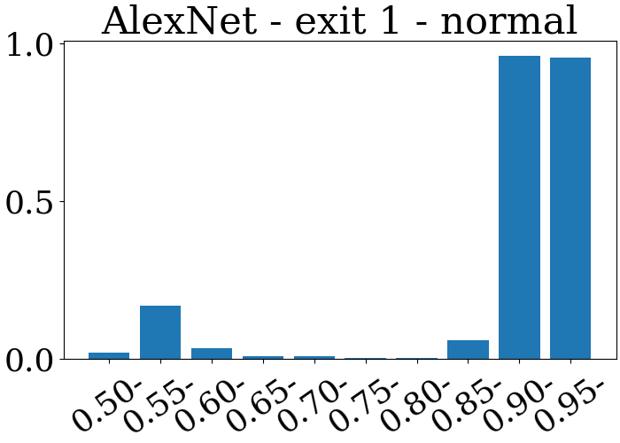
### Exit 1 | attack
```
0.5004 < x <= 0.5504: 989 | 783 | 0.7917
0.5504 < x <= 0.6003: 2659 | 1161 | 0.4366
0.6003 < x <= 0.6503: 2365 | 2106 | 0.8905
0.6503 < x <= 0.7002: 5976 | 5839 | 0.9771
0.7002 < x <= 0.7502: 6576 | 6490 | 0.9869
0.7502 < x <= 0.8002: 10368 | 10300 | 0.9934
0.8002 < x <= 0.8501: 56983 | 56875 | 0.9981
0.8501 < x <= 0.9001: 12296 | 11238 | 0.9140
0.9001 < x <= 0.9500: 66866 | 48232 | 0.7213
0.9500 < x <= 1.0000: 28955 | 28688 | 0.9908
['0.50-', '0.55-', '0.60-', '0.65-', '0.70-', '0.75-', '0.80-', '0.85-', '0.90-', '0.95-']
[0.7917087967644085, 0.4366303121474238, 0.8904862579281184, 0.9770749665327979, 0.9869221411192214, 0.9934413580246914, 0.9981046978923539, 0.9139557579700716, 0.7213232435019292, 0.9907787946814022]
```
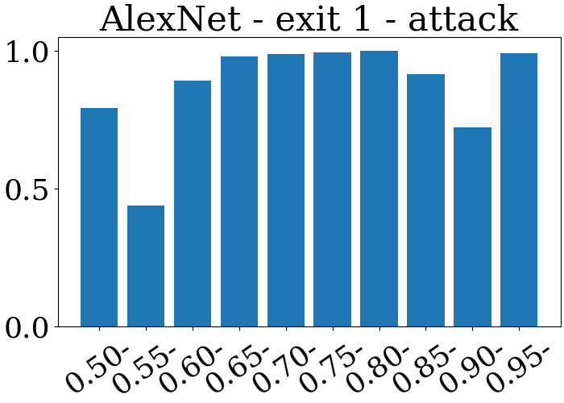
### Exit 2 | total
```
0.5001 < x <= 0.5501: 5235 | 2374 | 0.4535
0.5501 < x <= 0.6001: 2082 | 1399 | 0.6720
0.6001 < x <= 0.6500: 1560 | 992 | 0.6359
0.6500 < x <= 0.7000: 3270 | 2454 | 0.7505
0.7000 < x <= 0.7500: 3684 | 2788 | 0.7568
0.7500 < x <= 0.8000: 9867 | 6763 | 0.6854
0.8000 < x <= 0.8500: 12503 | 9810 | 0.7846
0.8500 < x <= 0.9000: 39100 | 34701 | 0.8875
0.9000 < x <= 0.9500: 263999 | 236884 | 0.8973
0.9500 < x <= 1.0000: 46749 | 46233 | 0.9890
['0.50-', '0.55-', '0.60-', '0.65-', '0.70-', '0.75-', '0.80-', '0.85-', '0.90-', '0.95-']
[0.45348615090735434, 0.6719500480307397, 0.6358974358974359, 0.7504587155963303, 0.756786102062975, 0.6854160332421202, 0.7846116931936336, 0.8874936061381075, 0.8972912776184758, 0.9889623307450427]
```
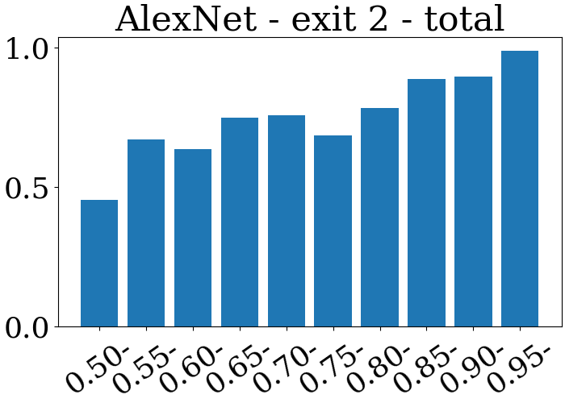
### Exit 2 | normal
```
0.5001 < x <= 0.5501: 2050 | 36 | 0.0176
0.5501 < x <= 0.6000: 657 | 24 | 0.0365
0.6000 < x <= 0.6500: 572 | 17 | 0.0297
0.6500 < x <= 0.7000: 1632 | 1237 | 0.7580
0.7000 < x <= 0.7500: 1449 | 870 | 0.6004
0.7500 < x <= 0.7999: 3108 | 13 | 0.0042
0.7999 < x <= 0.8499: 2689 | 22 | 0.0082
0.8499 < x <= 0.8999: 4317 | 18 | 0.0042
0.8999 < x <= 0.9498: 138946 | 131496 | 0.9464
0.9498 < x <= 0.9998: 38595 | 38222 | 0.9903
['0.50-', '0.55-', '0.60-', '0.65-', '0.70-', '0.75-', '0.80-', '0.85-', '0.90-', '0.95-']
[0.0175609756097561, 0.0365296803652968, 0.02972027972027972, 0.7579656862745098, 0.6004140786749482, 0.004182754182754183, 0.008181480104127928, 0.004169562195969423, 0.946382047701985, 0.9903355356911517]
```
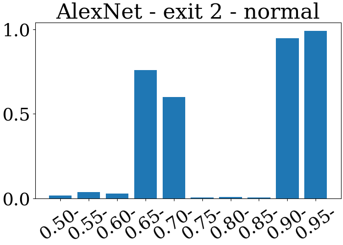
### Exit 2 | attack
```
0.5001 < x <= 0.5501: 3185 | 2338 | 0.7341
0.5501 < x <= 0.6001: 1422 | 1375 | 0.9669
0.6001 < x <= 0.6500: 990 | 975 | 0.9848
0.6500 < x <= 0.7000: 1637 | 1216 | 0.7428
0.7000 < x <= 0.7500: 2235 | 1919 | 0.8586
0.7500 < x <= 0.8000: 6760 | 6750 | 0.9985
0.8000 < x <= 0.8500: 9805 | 9788 | 0.9983
0.8500 < x <= 0.9000: 34762 | 34683 | 0.9977
0.9000 < x <= 0.9500: 125042 | 105388 | 0.8428
0.9500 < x <= 1.0000: 8195 | 8011 | 0.9775
['0.50-', '0.55-', '0.60-', '0.65-', '0.70-', '0.75-', '0.80-', '0.85-', '0.90-', '0.95-']
[0.734065934065934, 0.9669479606188467, 0.9848484848484849, 0.74282223579719, 0.8586129753914988, 0.9985207100591716, 0.9982661907190209, 0.9977274034865657, 0.8428208122070984, 0.9775472849298352]
```
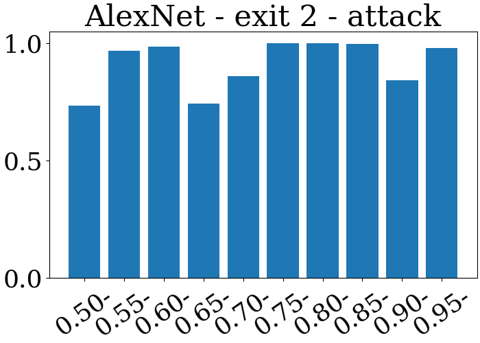
## Network: MobileNet
### Exit 1 | total
```
0.5000 < x <= 0.5500: 3188 | 1271 | 0.3987
0.5500 < x <= 0.6000: 2626 | 1973 | 0.7513
0.6000 < x <= 0.6500: 1649 | 1111 | 0.6737
0.6500 < x <= 0.7000: 1888 | 1310 | 0.6939
0.7000 < x <= 0.7500: 4063 | 3368 | 0.8289
0.7500 < x <= 0.8000: 4707 | 3111 | 0.6609
0.8000 < x <= 0.8500: 154312 | 134783 | 0.8734
0.8500 < x <= 0.9000: 59882 | 53373 | 0.8913
0.9000 < x <= 0.9500: 28010 | 22826 | 0.8149
0.9500 < x <= 1.0000: 127723 | 119395 | 0.9348
['0.50-', '0.55-', '0.60-', '0.65-', '0.70-', '0.75-', '0.80-', '0.85-', '0.90-', '0.95-']
[0.39868255959849436, 0.7513328255902514, 0.6737416616130989, 0.6938559322033898, 0.8289441299532365, 0.6609305289993627, 0.8734447094198766, 0.8913028956948665, 0.8149232416993931, 0.9347963953242564]
```
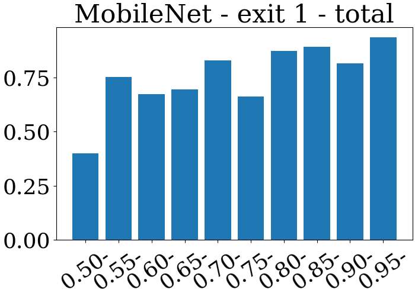
### Exit 1 | normal
```
0.5000 < x <= 0.5500: 1012 | 525 | 0.5188
0.5500 < x <= 0.6000: 1601 | 1200 | 0.7495
0.6000 < x <= 0.6500: 478 | 198 | 0.4142
0.6500 < x <= 0.7000: 359 | 30 | 0.0836
0.7000 < x <= 0.7500: 663 | 63 | 0.0950
0.7500 < x <= 0.8000: 877 | 299 | 0.3409
0.8000 < x <= 0.8500: 131533 | 130619 | 0.9931
0.8500 < x <= 0.9000: 6648 | 157 | 0.0236
0.9000 < x <= 0.9500: 5364 | 263 | 0.0490
0.9500 < x <= 1.0000: 45479 | 37401 | 0.8224
['0.50-', '0.55-', '0.60-', '0.65-', '0.70-', '0.75-', '0.80-', '0.85-', '0.90-', '0.95-']
[0.5187747035573123, 0.749531542785759, 0.41422594142259417, 0.08356545961002786, 0.09502262443438914, 0.3409350057012543, 0.9930511734697757, 0.02361612515042118, 0.04903057419835943, 0.8223795597968293]
```
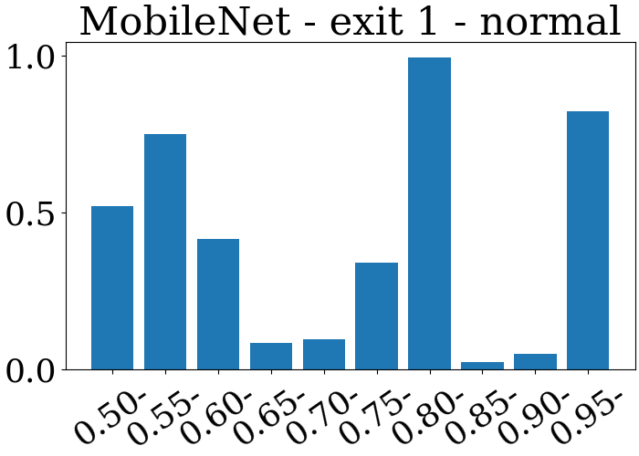
### Exit 1 | attack
```
0.5001 < x <= 0.5501: 2177 | 747 | 0.3431
0.5501 < x <= 0.6000: 1023 | 771 | 0.7537
0.6000 < x <= 0.6500: 1171 | 913 | 0.7797
0.6500 < x <= 0.7000: 1530 | 1280 | 0.8366
0.7000 < x <= 0.7500: 3400 | 3306 | 0.9724
0.7500 < x <= 0.8000: 3829 | 2811 | 0.7341
0.8000 < x <= 0.8500: 22779 | 4164 | 0.1828
0.8500 < x <= 0.9000: 53235 | 53217 | 0.9997
0.9000 < x <= 0.9500: 22647 | 22564 | 0.9963
0.9500 < x <= 1.0000: 82242 | 81992 | 0.9970
['0.50-', '0.55-', '0.60-', '0.65-', '0.70-', '0.75-', '0.80-', '0.85-', '0.90-', '0.95-']
[0.3431327514928801, 0.7536656891495601, 0.7796754910333049, 0.8366013071895425, 0.9723529411764706, 0.7341342387046226, 0.1827999473198999, 0.9996618765849535, 0.9963350554157283, 0.996960190656842]
```
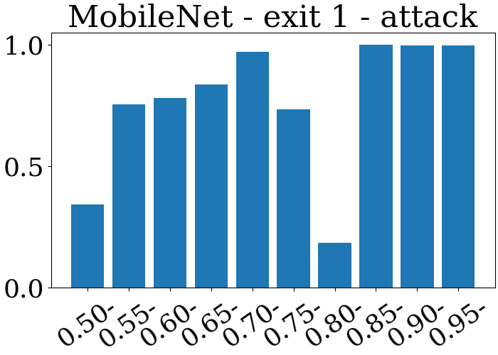
### Exit 2 | total
```
0.5001 < x <= 0.5501: 1540 | 281 | 0.1825
0.5501 < x <= 0.6000: 2168 | 640 | 0.2952
0.6000 < x <= 0.6500: 688 | 321 | 0.4666
0.6500 < x <= 0.7000: 5387 | 3107 | 0.5768
0.7000 < x <= 0.7500: 1356 | 962 | 0.7094
0.7500 < x <= 0.8000: 2748 | 2181 | 0.7937
0.8000 < x <= 0.8500: 16343 | 11190 | 0.6847
0.8500 < x <= 0.9000: 172212 | 150589 | 0.8744
0.9000 < x <= 0.9500: 111837 | 103076 | 0.9217
0.9500 < x <= 1.0000: 73770 | 71804 | 0.9733
['0.50-', '0.55-', '0.60-', '0.65-', '0.70-', '0.75-', '0.80-', '0.85-', '0.90-', '0.95-']
[0.18246753246753247, 0.2952029520295203, 0.46656976744186046, 0.5767588639316874, 0.7094395280235988, 0.7936681222707423, 0.6846968120908034, 0.8744396441595244, 0.9216627770773537, 0.9733496001084452]
```
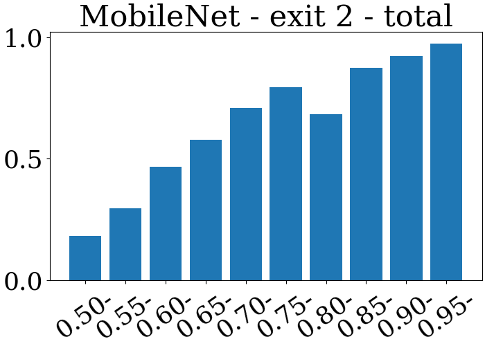
### Exit 2 | normal
```
0.5001 < x <= 0.5501: 609 | 131 | 0.2151
0.5501 < x <= 0.6000: 1494 | 50 | 0.0335
0.6000 < x <= 0.6500: 372 | 52 | 0.1398
0.6500 < x <= 0.7000: 2190 | 1225 | 0.5594
0.7000 < x <= 0.7500: 391 | 4 | 0.0102
0.7500 < x <= 0.8000: 560 | 2 | 0.0036
0.8000 < x <= 0.8500: 5151 | 8 | 0.0016
0.8500 < x <= 0.9000: 134529 | 131503 | 0.9775
0.9000 < x <= 0.9500: 8803 | 50 | 0.0057
0.9500 < x <= 1.0000: 39916 | 38088 | 0.9542
['0.50-', '0.55-', '0.60-', '0.65-', '0.70-', '0.75-', '0.80-', '0.85-', '0.90-', '0.95-']
[0.21510673234811165, 0.03346720214190094, 0.13978494623655913, 0.5593607305936074, 0.010230179028132993, 0.0035714285714285713, 0.0015530964861192001, 0.9775067085907128, 0.005679881858457344, 0.9542038280388816]
```
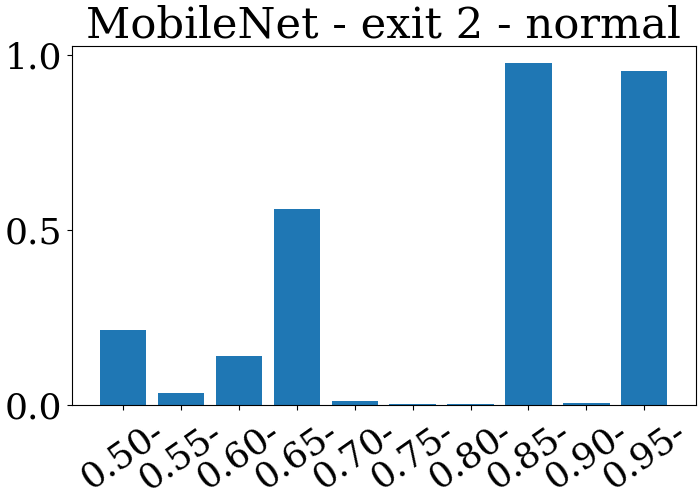
### Exit 2 | attack
```
0.5001 < x <= 0.5501: 931 | 150 | 0.1611
0.5501 < x <= 0.6001: 673 | 590 | 0.8767
0.6001 < x <= 0.6500: 316 | 269 | 0.8513
0.6500 < x <= 0.7000: 3196 | 1881 | 0.5885
0.7000 < x <= 0.7500: 963 | 956 | 0.9927
0.7500 < x <= 0.7999: 2188 | 2179 | 0.9959
0.7999 < x <= 0.8499: 11193 | 11183 | 0.9991
0.8499 < x <= 0.8999: 37660 | 19063 | 0.5062
0.8999 < x <= 0.9498: 102970 | 102962 | 0.9999
0.9498 < x <= 0.9998: 33943 | 33805 | 0.9959
['0.50-', '0.55-', '0.60-', '0.65-', '0.70-', '0.75-', '0.80-', '0.85-', '0.90-', '0.95-']
[0.1611170784103115, 0.8766716196136701, 0.8512658227848101, 0.5885481852315394, 0.9927310488058152, 0.9958866544789763, 0.9991065844724382, 0.5061869357408391, 0.9999223074681947, 0.9959343605456206]
```
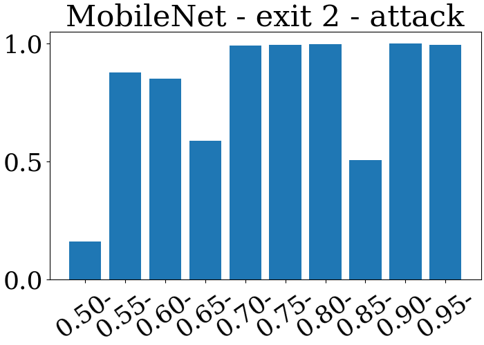
